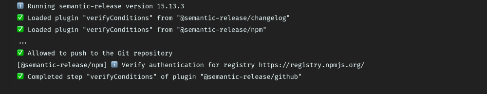
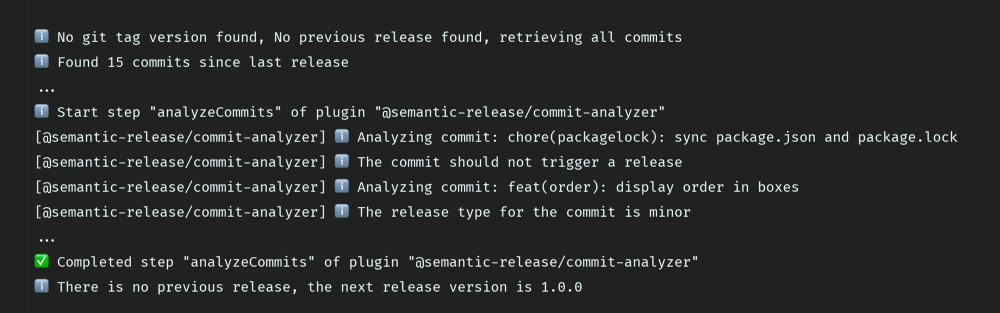
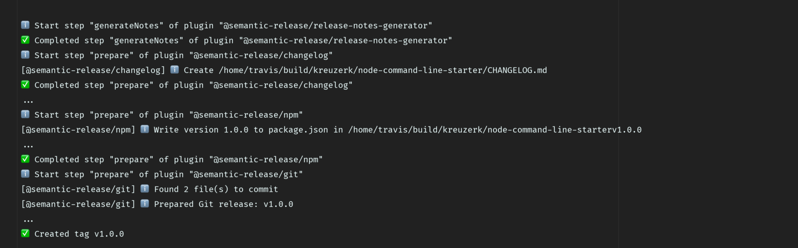
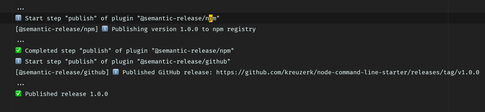
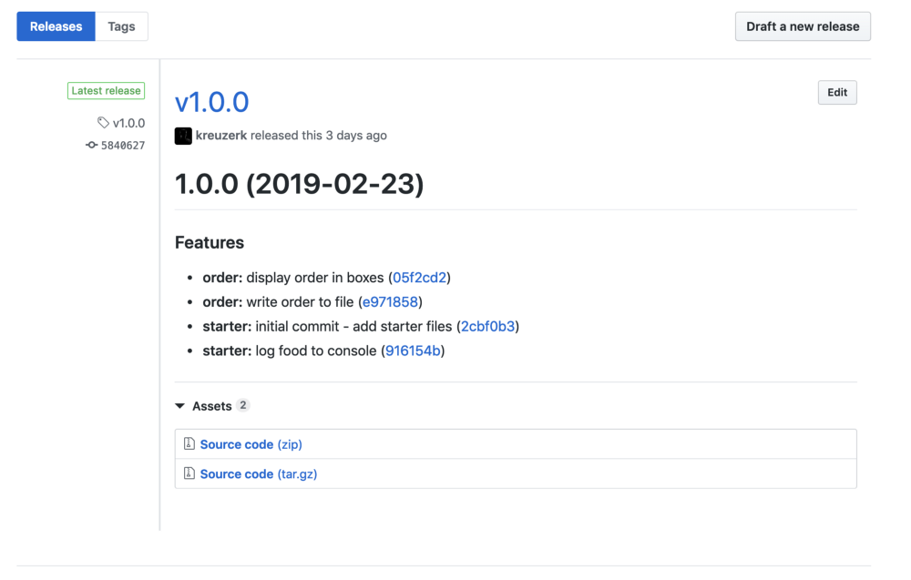

# Semver Software Options

## Main Options

* [Semantic Release](#semantic-release)
* [Go Releaser](#go-releaser)
* [Go Semantic Release](#go-semantic-release)
* [Standard Version](#standard-version)
* [Release It](#release-it)
* [Release Please](#release-please)

## 📦🚀 Semantic Release

### Website

* GitHub: <https://github.com/semantic-release/semantic-release>
* Official: <https://semantic-release.gitbook.io/semantic-release/>

### Details

* Fully manages every aspect of the release of a project. Determines semver version based on conventional commit history
* Very popular 12k GitHub stars, [41K usage](https://github.com/semantic-release/semantic-release/network/dependents?package_id=UGFja2FnZS0xNDMwNDMzNw%3D%3D)
* Well Maintained
* Node based, would require used of node based docker image
* Good Documentation, lots of examples

### Features

* Fully automated semver version management
* Enforce Semantic Versioning specification
* Automated Changelog creation (conventional commits)
* package publishing
* release config stored in `.releaserc` file
  - supported formats .yaml/.yml/.json/.js
* plugin based, see notes below about plugins

### Release Steps

<https://github.com/semantic-release/semantic-release#release-steps>

The typical release is based off of these plugins:

* `@semantic-release/commit-analyzer`
  - Can release based off commit messages, First we analyze the commit message to decide if a new breaking change, feature or fix was included. If not, no release is needed.
* `@semantic-release/release-notes-generator`
  - Next up we generate the CHANGELOG. The CHANGELOG content is generated by the release-notes-generator plugin and written by the changelog plugin.
* `@semantic-release/changelog`  -- generates CHANGELOG file
* `@semantic-release/npm` (this bumps version in package.json)...we could write our own plugin that bumps the version in a semver branch ??
* `@semantic-release/github` -- commit change back to GitHub, special commit message required to skip release automation

### Example usage:

#### Step 1: Load Plugins


#### Step 2: Analyze Commits


#### Step 3: Generate Release Notes/Changelog


#### Step 4: Publish Release to GitHub


#### Step 5: Profit


### Links:

* <https://github.com/semantic-release/semantic-release/blob/master/docs/extending/plugins-list.md>
* <https://github.com/semantic-release/semantic-release/blob/master/docs/recipes/jenkins-ci.md>
* <https://kevinkreuzer.medium.com/the-way-to-fully-automated-releases-in-open-source-projects-44c015f38fd6#:~:text=Standard%2Dversion%20vs%20semantic%2Drelease&text=Standard%2Dversion%20mainly%20focuses%20on,version%20management%20and%20package%20publishing>
* <https://www.asyncapi.com/blog/automated-releases-part-two>


## Go Releaser


### Website

* GitHub: <https://github.com/goreleaser/goreleaser/>
* Official: <https://goreleaser.com/>

### Details

* Written in Go, seems lightweight
* Cross-compile your Go project
* Release to GitHub, GitLab
* Create Docker images and manifests
* Create Linux packages and Homebrew taps
* Newish project ~ 1 Year old
* 7.6K Stars
* GitHub Action support
* [4K Code usages of their GitHub Action](https://github.com/search?q=%22uses%3A+goreleaser%2Fgoreleaser-action%22&type=code)
* Good Documentation, lots of examples

### Features

* Release config stored in `.goreleaser.yml` file

### Example Config

```yaml
# This is an example goreleaser.yaml file with some sane defaults.
# Make sure to check the documentation at http://goreleaser.com
before:
  hooks:
    # you may remove this if you don't use vgo
    - go mod download
    # you may remove this if you don't need go generate
    - go generate ./...
builds:
- env:
  - CGO_ENABLED=0
archive:
  replacements:
    darwin: Darwin
    linux: Linux
    windows: Windows
    386: i386
    amd64: x86_64
checksum:
  name_template: 'checksums.txt'
snapshot:
  name_template: "{{ .Tag }}-next"
changelog:
  sort: asc
  filters:
    exclude:
    - '^docs:'
    - '^test:'
```

### Links

* <https://goreleaser.com/intro/>
* <https://goreleaser.com/quick-start/>
* <https://dev.to/koddr/github-action-for-release-your-go-projects-as-fast-and-easily-as-possible-20a2/>
* <https://medium.com/@stepanvrany/painless-github-releases-with-drone-and-goreleaser-853bbbccd0c0/>
* <https://codefresh.io/docs/docs/learn-by-example/golang/goreleaser/>
* <https://carlosbecker.com/posts/goreleaser-lessons-learned/>


## 📦🚀 Go Semantic Release

A more lightweight and standalone version of semantic-release.

### Website

* <https://github.com/go-semantic-release/semantic-release>

### Details

* Written in Go
* GitHub action that automates the bumping of semver and will create a GitHub release
* New project ~ 1 Year old
* 113 GitHub Stars (Not a lot of adoption)
* Documentation not great
* Not very many features
* Plugin based
* Docker Support
  - registry.gitlab.com/go-semantic-release/semantic-release:latest
  - https://github.com/go-semantic-release/semantic-release/blob/master/Dockerfile

### Links

* <https://github.com/go-semantic-release/semantic-release>


## Standard Version

A utility for versioning using semver and CHANGELOG generation powered by Conventional Commits.

### Website

* <https://github.com/conventional-changelog/standard-version>

### Details

* Written in Javascript
* Automates the bumping of semver, no GitHub release
* Automated CHANGELOG generation
* Very simple, matches git-semver functionality the closest
* Well established project and community
* 4.7K GitHub Stars
* Documentation OK, All in README of repo
* Not too many examples
* Not very many features

### Features

* Config stored in project root in `.versionrc`, `.versionrc.json` or `.versionrc.js`
* Supports Pre-release tags

### How It Works

* Follow the Conventional Commits Specification in your repository.
* When you're ready to release, run standard-version.
* standard-version will then do the following:
  - Retrieve the current version of your repository by looking at `packageFiles`, falling back to the last git tag.
  - bump the version in `bumpFiles` based on your commits.
  - Generates a changelog based on your commits (uses conventional-changelog under the hood).
  - Creates a new commit including your `bumpFiles` and updated CHANGELOG.
  - Creates a new tag with the new version number.

### Links

* <https://github.com/conventional-changelog/standard-version#how-is-standard-version-different-from-semantic-release>

## Release It! 🚀

### Website

<https://github.com/release-it/release-it>

### Details

* Written in Javascript
* 3.9K GitHub stars
* Well maintained
* Large community and adopters

### Features

* Execute test & build commands
* Bump version (in e.g. package.json)
* Git commit, tag, push
* Create release at GitHub or GitLab
* Generate changelog
* Manage pre-releases
* Release from any CI/CD environment
* Release config stored in `.release-it.[json|js|yaml|toml]` file
* Plugins: <https://github.com/release-it/release-it#plugins>

### Example Config

```json
{
  "git": {
    "commitMessage": "chore: release v${version}"
  },
  "github": {
    "release": true
  }
}
```

### Example Usage

```bash
release-it minor --git.requireBranch=master --github.release --no-npm.publish
```

### Links

* <https://github.com/release-it/release-it>
* <https://github.com/release-it/release-it#example-projects-using-release-it>


## Release Please (GitHub Action)

Release Please automates CHANGELOG generation, the creation of GitHub releases, and version bumps for your projects. Release Please does so by parsing your git history, looking for Conventional Commit messages, and creating release PRs.

* Project by Google
* 114 GitHub stars (Not a lot of adoption)
* Well maintained
* GitHub Action

### Website

* <https://github.com/marketplace/actions/release-please-action>


## Honorable mentions

* <https://github.com/erdaltsksn/git-bump>
* <https://github.com/topics/release-automation?l=go>
* <https://awesomeopensource.com/projects/release-automation?categoryPage=3>

## What Other Open Source Projects Are Using


### Snyk

* semantic-release for release notes
* Lerna for semver and publish to npm

### Hashicorp

Example: v0.15-beta1

* Manually release versions?
* Initiated via this commit: https://github.com/hashicorp/terraform/commit/56f2d06b00eef823aeb78b30ea8be045abbd0290
* https://app.circleci.com/pipelines/github/hashicorp/terraform?branch=v0.15
* https://github.com/hashicorp/terraform/compare/v0.15#diff-f6bf0ae0d21c9408c6624174da11dafb369ce306f2cdcea704285d8acc87e19e

### Rancher

### GitHub Actions
* Marketplace GitHub Actions for Release: https://github.com/marketplace?type=actions&query=release
